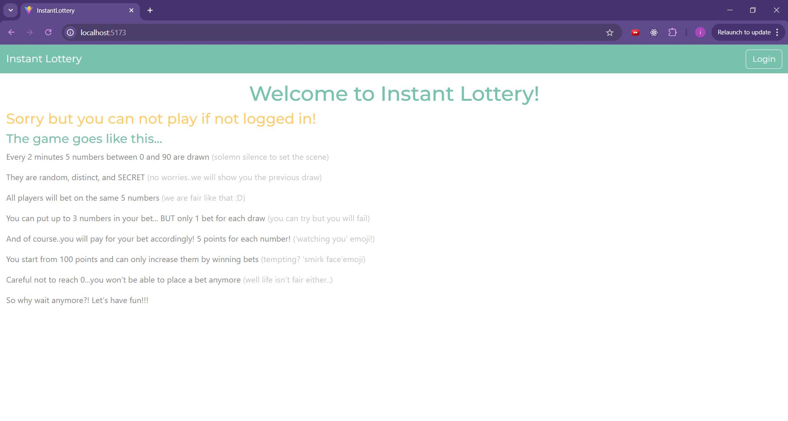
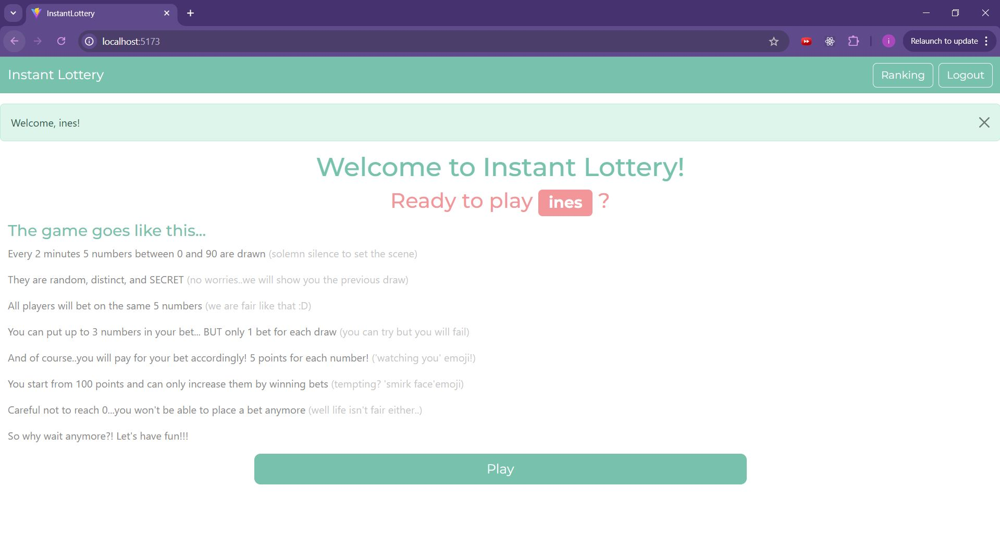
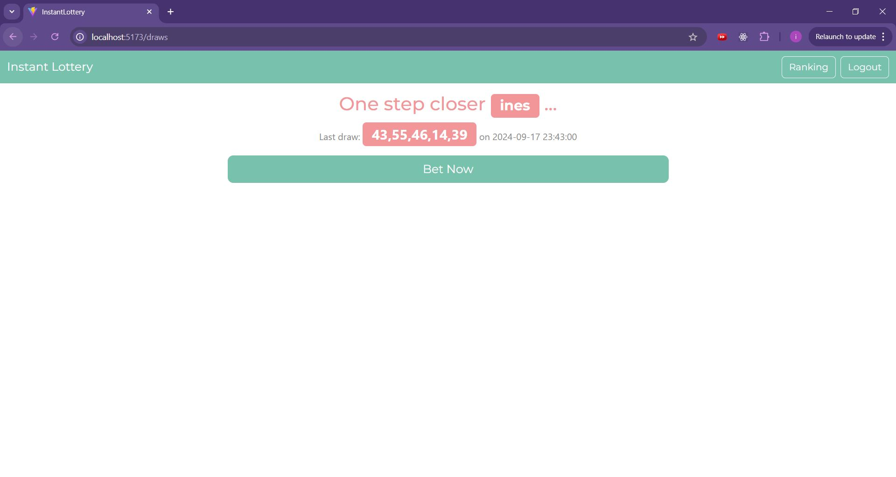
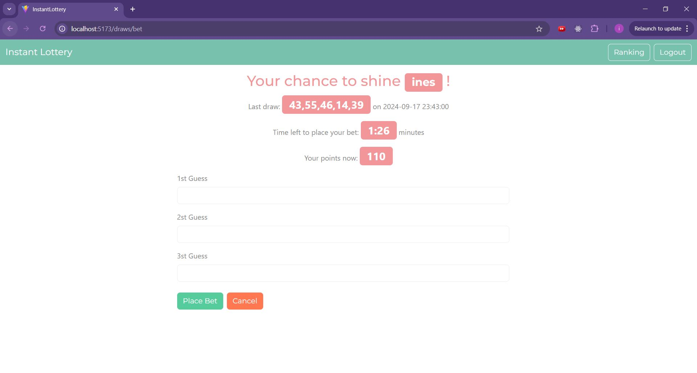
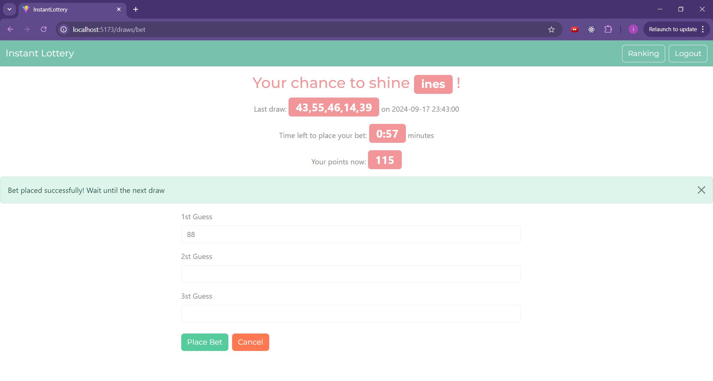
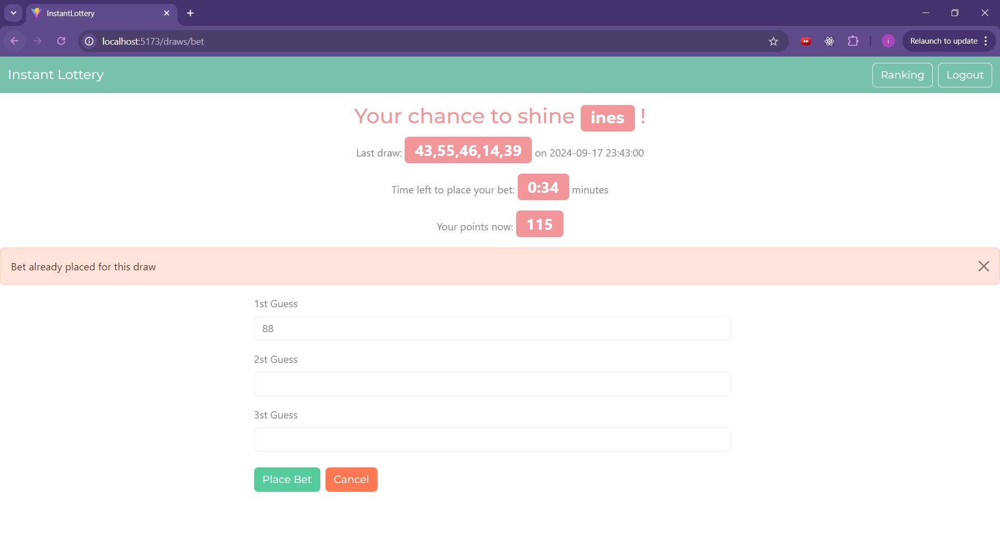
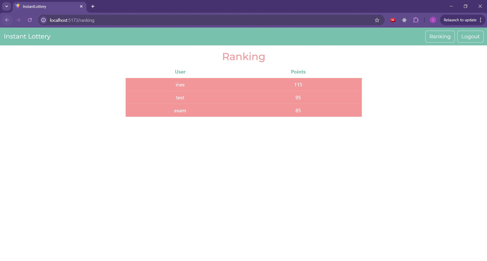
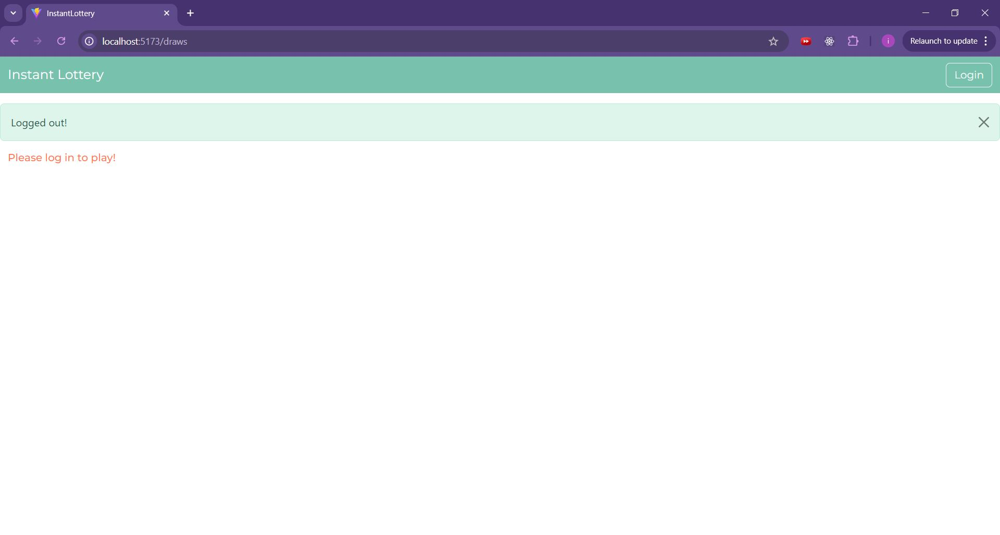

# Exam #3: "Instant Lottary"
## Student: s314051 MUKA INES 

## React Client Application Routes

- Route `/`: Welcome page. This serves as an entry point to our web application. It welcomes the users and displays the game rules at all time. From here the user can access the login page by clicking on the button 'Login' on the navbar. Once the user is authenticated it returns to this page where a welcoming message with the user name is displayed and it can navigate to the page displaying the last completed draw by clicking on the button 'Play' or it can access the Ranking page by clicking the button 'Ranking' on the navbar. Close to it now the 'Login' button has changed to 'LogOut' that logs you out on click. Instead if the user is not logged in the page indicates you can not play if not logged in
- Route `/login`: Login page. This serves as the page where the user can log in by entring its email and password. It authenticates the user or not based on the fact if it is a registered user of the web app (users info resides in database). If yes it redirects the authenticated user back to the Welcome page, if not gives an appropriate message. The user autheticated or not has the possibility to access the Welcoming page by clicking the logo on the navbar.
- Route `/draws`: Page displaying the last completed draw. This serves as an introductory page to the game, it gives a welcoming message to the authenticated user, shows the last completed draw (on which the bets are closed): the 5 numbers and the timestamp of creation, and invites the user to start the game by clicking on the 'Bet Now' button that redirects it on the Betting page. The displayed draw is automatically updated in real time. Again here the authenticated user has the possibilty to access the Welcoming page (by clicking on the logo of navbar), the Ranking page or to log out by the appropriate buttons in the navbar. If this route is attempted to be accessed without logging in first, it will show an appropriate message indicating that you need to be logged in to see the content.
- Route `/draws/bet`: Betting page. Here is the center of our game. Again a welcoming message for the authenticated user, and also the last completed draw as in the previous page. In addition here is displayed also a countdown timer to let you know how much time is left to place the bet. This gets updated automatically when a new draw is generated. It also shows the authenticated user the current state of its points and they get updated automatically and accordingly in case of a bet placed. There are 3 input fields for each guess we can make for one bet, each accepts only numbers from 1 to 90 and at least one should be not empty for the bet to be placed. There is a button to Submit and a button to Cancel (which takes the autheticated user back to the previous page). The user is informed accordingly in case the bet was not set successfully or set successfully via appropriate messages. Again here the authenticated user has the possibilty to access the Welcoming page (by clicking on the logo of navbar), the Ranking page or to log out by the appropriate buttons in the navbar. If this route is attempted to be accessed without logging in first, it will show an appropriate message indicating that you need to be logged in to see the content.
- Route `/ranking`: Ranking page. This pages serves only for the purpose of seeing the 3 top users of the game, ordered by descending order of their points. Again here the authenticated user has the possibilty to access the Welcoming page (by clicking on the logo of navbar) or to log out by the appropriate button in the navbar. If this route is attempted to be accessed without logging in first, it will show an appropriate message indicating that you need to be logged in to see the content.

## Main React Components

- `LoginForm` (in `AuthComponents.jsx`): the purpose of this component is to rended the Login Form for the Login page. It manages the credentials, these being username and password as states so they can be handle the user input for username and password. (Note: here the username is actually referring to email of the user). When the button 'Login' is clicked the credentials are passed to the login (and to handleLogin function in App.jsx) to perfrom the login and set the messages that will be displayed to the user accordingly. In the same way this form also handles log out (LogOutButton component).
- `NavHeader` (in `Navheaded.jsx`): the purpose of this component is to render the navbar accross all routes/pages we discribed earlier. At all times it has a link to the Welcome page and then depending if the user is logged in or not shows the Ranking button and LogOut button or Login button respectively.
- `WelcomeLayout` (in `WelcomeComponent.jsx`): the purpose of this component is to render the Welcome page, always showing the game rules and then the appropriate messages depending if the user is logged in or not.
- `DrawLayout` (in `DrawLayout.jsx`): the purpose of this component is to render the page displaying the last completed draw alongside with an appropriate message to the user and the 'Play' button if the user is logged in. If not it indicates the user it needs to log in to play. How the draw is fetched, saved in states and updated is actually handeled in App.jsx that is the parent component (since this information will be accessed also from the BetLayout component). How i decided to perform this is by using useEffect in order to fetch the data through an API call in an interval whenever the route correspond to /draws or /draws/bet. We can say this is a form of polling, because every second we are "asking the server" if there is a new draw, but i choose this solution in order to have a real time automated update on the web app for the user to have the best experience, even though it is at the expense of a larger number of API calls. 
- `BetLayout` (in `BetLayout.jsx`): the purpose of this component is to render the Betting page with its welcoming message to authenticated user, info about the last completed draw, info about the remaining time to place a bet, info about the user points, and the form to submit the new bet with its 3 possible guesses. The info about last completed draw is taken care of by passing down the needed props from the parent component (in this case App.jsx) and displaying them in the same way we did in DrawLayout component. Meanwhile the countdown is handled inside the component with a useEffect that tries to fetch the timestamp of the last draw (the one that is still a secret and is the one the user is betting on), calculate the remaining time, and displaying it to the user. All this to ensure a real time update and a smooth presentation to the user. Almost in the same way it handles also the display of user points in real time. But here it does not need to ask continuosly on the points state, instead it updates them upon placing a bet. Inside the same file we have also `BetForm` component with deals with the input form for placing new bets. It does the needed checks, if the inputs are valid (distinct numbers from 1 to 90 and at least 1 number out of 3 submitted) and does the API calls to save the bet correctly. All these while taking care of informing the user with appropriate alert messages. 
- `RankingLayout` (in `RankingLayout.jsx`): the purpose of this component is to render the Ranking page with the top 3 users in descending order depending on their points. To correctly fetch the list of users we again have useEffect and the info of the ranked users is held on a state. This info is then displayed in a tabular form for the user.
- `App` (in `App.jsx`): this actually is the root component and is responsible for setting all the routes we described in the section above, passing all the needed props. And as we mentioned earlier it also is in charge of handling the last completed draw information, the authentication info, the log in and log out.

In the client side we also have `API.mjs` that handles the client side of all the fetches done to API server. The functions included are:
- logIn (POST `/api/sessions`) to send the credentials in order for the session initiation to be done. It returns the authenticated user.
- getUserInfo (GET `/api/sessions/current`) It returns the current authenticated user that holds the session.
- getPoints (GET `/api/points?userId=${userId}`) It returns the points of the current authenticated user, by sending the userId as a query.
- logOut (DELETE `/api/sessions/current`) It ends the session.
- getDraws (GET `/api/draws`) It gets the last completed draw with its full information: id, draw_numbers, draw_timestamp.
- getLastDrawTimestamp (GET `/api/lastDrawTimestamp`)It gets only the draw_timestamp of the last generated draw on which bets are being put on. In order to protect the draw (which needs to be secret until completed) it returns only the timestamp of its creation.
- saveBet (POST `/api/bet`) It sends along just enough information (user_id, draw_id, bet_numbers, bet_timestamp) needed for the server side to  work on it and to save a new bet.
- getRanking (GET `/api/ranking`) It gets the list of ranked users (only their constricted information as id, name, and points, so no password is sent in any other time except of login).

What is important to mention here is that all these fetches are being constricted to have credentials included, so there is no chance that the data is leaked to non (registerd-authenticated) users. And also all the error are caught and thrown accordingly so that the React components can handle them properly and inform the user accordingly.

Another point on the Client side is the .css file `(.src/styles/bootstrap.min.css)` that is actually downloaded from https://bootswatch.com/ as a free theme for Bootstrap. 

## API Server

- POST `/api/sessions`: the authenticate the user sent in request using `passport`
  - it receives the email and password in request
  - sets back the authenticated user
  - status 201 if authentication was done correctly
  - status 401 if user was not found

- GET `/api/sessions/current`: to check if the user is authenticated or not already
  - user info in request
  - if user is authenticated sents it back in response 
  - status 401 if the user was found to not be authenticated

- DELETE `/api/sessions/current`: to delete the session when we are performing logout
  - session info in req
  - end of response

- GET `/api/draws`: to get back the last completed draw
  - no request parameters but needs isLoggedIn=true (where isLoggedIn is a middleware to check if the user in request is authenticated) to show that the request came from an authenticated user (since we are including credentials) 
  - the Draw object of the last completed draw (drawId, draw_numbers, draw_timestamp). Makes use of the `getLastCompletedDraw()` of `draw_dao.mjs`
  - status 404 in case no draw is found 
  - status 500 in case there is a problem with the database

- GET `/api/lastDrawTimestamp`: to get back the creation timestamp of the last draw (that is also the draw the bets are being put on)
  - no request parameters but needs isLoggedIn=true to show that the request came from an authenticated user (since we are including credentials)
  - the drawTimestamp only in the response (not the whole Draw object). Makes use of the `getCurrentDraw()` of `draw_dao.mjs`
  - status 404 in case no draw is found 
  - status 500 in case there is a problem with the database

- POST `/api/bet`:the main purpose is to save the bet and update the user points accordingly. In order to achieve this it validates the incoming bet info (with validator-express), sees if a bet was already placed on the current draw (`getBetForDraw(userId,drawId)` used from `bet_dao.mjs`), sees if the bet was placed in an acceptable time, calculates if the user had enough points to set the bet, calculates the points spent (`calculatePointsSpent()` used from `bet_dao.mjs`), calculates the correct guesses done on the bet, calculates the points gained on the bet (`calculatePointsWon()` used from `bet_dao.mjs`), saves the bet in database, and finally updates the user points accordingly (these two in one atomic transition with `placeBetAndUpdatePoints()` from `bet_dao.mjs`)
  - in request we have: userId (checked to be not empty), drawId (checked to be not empty), betNumbers (checked to be an array), betTimestamp (checked to be a valid date through custom validation since dayjs not supported in express-validator). Also needs isLoggedIn=true to show that the request came from an authenticated user (since we are including credentials)
  - in case bet was saved successfully a response with {success:true} is sent back (status 200)
  - status 200 - everything done successfully
  - status 500 - if a problem with database occured , error: Failed to place the bet
  - status 400 - if there was a problem with the bet request: errors: Cannot place a bet after the draw has occurred, Bet already placed for this draw, Not enough points to place this bet

- GET `/api/ranking`: get back the array of 3 top users depending on their points (as ConstrictedInfoUser objects since only name and points of user)
  - no request parameters but needs isLoggedIn=true to show that the request came from an authenticated user (since we are including credentials)
  - array of max 3 users as ConstrictedInfoUser objects with the highest points
  - status 500 if we are not able to get the users from the database

- GET `/api/points`: get back the points of the user
  - userId in request.query and needs isLoggedIn=true to show that the request came from an authenticated user (since we are including credentials)
  - points in response
  - status 404 if we do not find the user with the userId provided
  - status 500 if a problem with database occured

## Database Tables

- Table `users` - it holds the users information: id, name, email, password, salt, points. Primary key: id. The password and salt are stored in a hashed format. Points by default set to 100 for new users.
- Table `draws` - it holds the draws information: id, draw_numbers, draw_timestamp. Primary key: id. The draw_numbers are saved in text comma separated and they are 5 distinct, from 1 to 90, randomly generated numbers. and the draw_timestamp is the timestamps of creation/generation of the draw
- Table `bets` - it holds the bets information: id, user_id, draw_id, bet_numbers, points_spent, correct_guesses, points_won, bet_timestamp. Primary key: id. Foreign keys: user_id referencing users table, draw_id referencing draws table. Bet_numbers can be from 1 to 3 numbers saved in tex comma separated and they are distinct from 1 to 90. Points spent depending on how many guesses in bet. Correct_guesses is the common numbers between bet_numbers and draw_numbers of that draw_id. Points_won depending on how many of the guesses were correct. Bet_timestamp is the timestamp when bet was submited by the user.

## Screenshots

## Users Credentials

- email:test.test@test.com, password: testtest
- email:ines.test@test.com, password: testtest
- email:exam.test@test.com, password: testtest